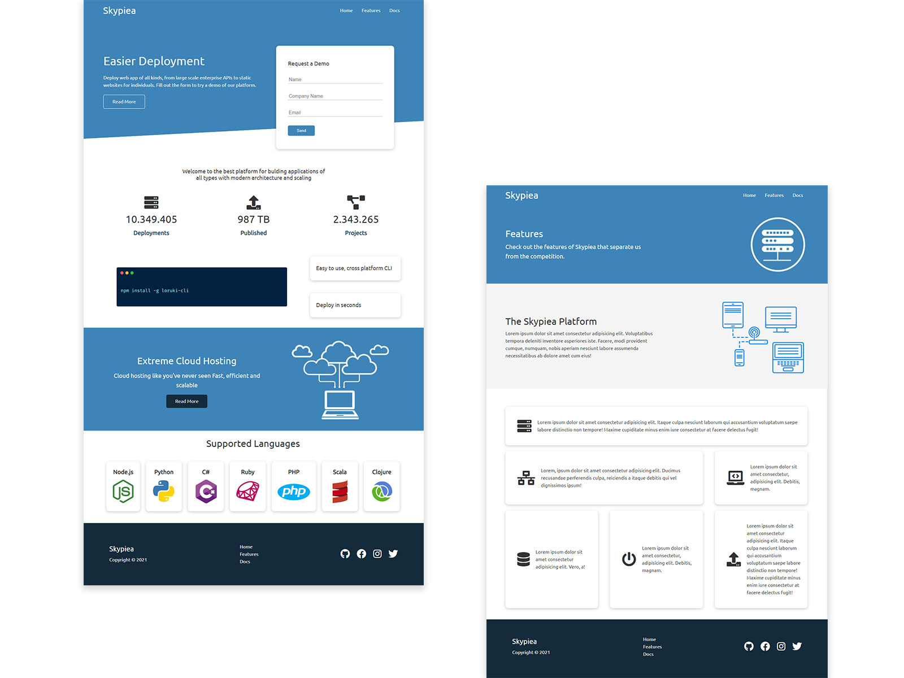

# Skypiea Cloud Hosting

Site para o serviço de hospedagem Skypiea

 

 

## Fonte Utilizada

[Ubuntu](https://fonts.google.com/specimen/Ubuntu)

 

## Icons

[Font Awesome](https://cdnjs.com/libraries/font-awesome)

 

## Live Preview

https://robsonvinicius.github.io/skypiea-cloud-hosting/

<!--
Tecnologia | Descrição | Versão | Site
------------ | ------------- | ------------ | ------------
HTML | Uma biblioteca JavaScript para criar interfaces de usuário | 16.13.1 | https://pt-br.reactjs.org/

-->
